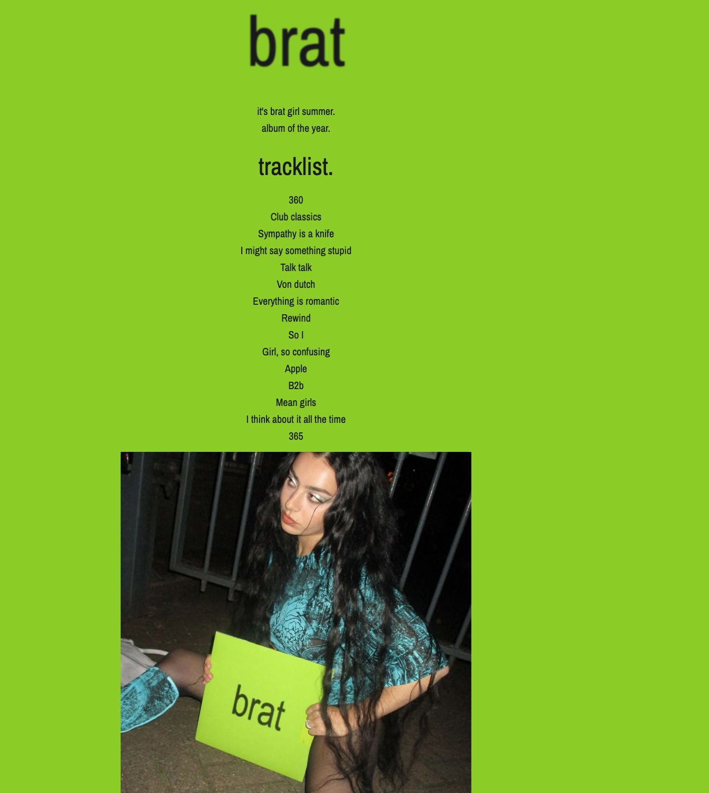

# Charli XCX - brat Album Fan Page

A simple fan page dedicated to Charli XCX's album "brat," featuring a tracklist, album imagery, and a pulsing text animation. Built with HTML and CSS.

## Table of Contents

- [About](#about)
- [Screenshot](#screenshot)
- [Technologies Used](#technologies-used)
- [Setup Instructions](#setup-instructions)
- [Live Demo](#live-demo)
- [License](#license)

## About

This project is a fan page created as an assignment to celebrate Charli XCX's album "brat." It includes a visually appealing layout with a tracklist, album cover image, a quote from Charli XCX, and links to her official website and album streaming platforms.

## Screenshot



## Technologies Used

- HTML
- CSS

## Setup Instructions

1. Clone the repository:

   ```bash
   git clone https://github.com/samantha-sutter/brat-album-site.git

   ```

Navigate to the project directory and open index.html in your web browser to view the website.

## Live Demo

View the live demo of the website [here](https://slsutter.soisweb.uwm.edu/240/assignment-1-brat/).

## License

This project is licensed under the MIT License. See the [LICENSE](LICENSE) file for details.
